# Design

## Diagram

## Parameters

- source
  - sine
  - square
  - triangle
  - sawtooth
  - noise
- filter
  - lowpass
  - cutoff frequency
  - resonance
- envelope
  - attack
  - delay
  - sustain
  - release